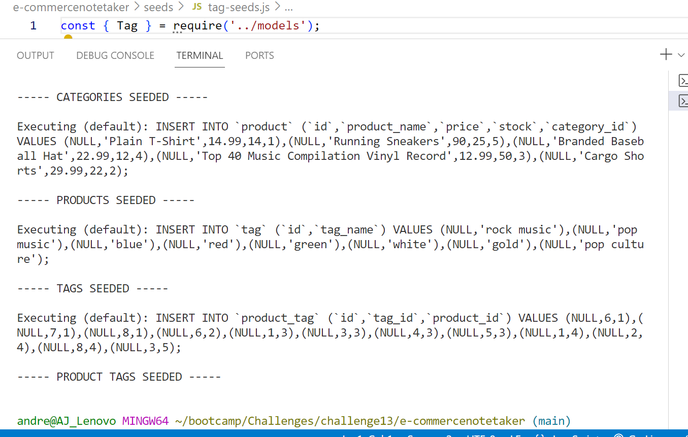

# e-commercenotetaker
 conveniently engage in online buying and selling of electronic products. 

WHY WAS THIS PROJECT BUILT?
WHAT PROBLEM DOES THIS SOLVE?

I learned from this to configure Express.js API to sue Sequelize to interact with a MySQL database.

I worked with a tudor and a TA in order to figure out how to code this.  Code is still in progress:  

Github link :  https://github.com/andrettaj/e-commercenotetaker

This is still a work in progress, still there are errors.
here is what I have so far:
Walkthrough video link:
https://drive.google.com/file/d/1-6Hk-CI9ROv537iXFGKCyqZYMXTK3cN_/view
